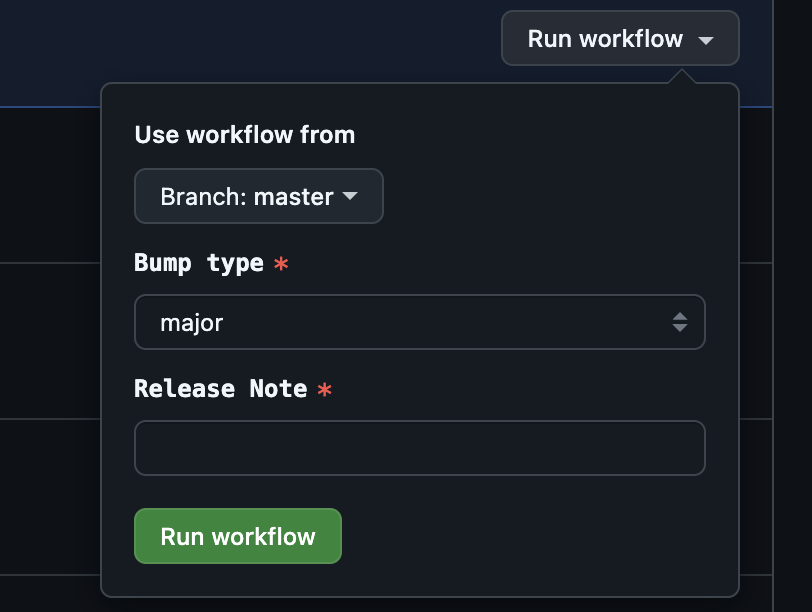

## Table of content

## Introduction
The app release process is a repeatative process and take too much time to version bump, build and upload it to play store or other app stores.

To simplify the process I've automated this process in my project [KeyPass](https://github.com/yogeshpaliyal/KeyPass) using Github Actions.

## Requirements
For most of the apps we have these requirements, there may be different requirements for your app.
1. **Bump type:** 
- **major(x):** 1.0.0 -> 2.0.0
- **minor(y):** 1.0.0 -> 1.1.0
- **patch(z):** 1.0.0 -> 1.0.1
1. **Release Notes:** Update the release note for each release.

## Prerequisites
- Basic idea of [Github Actions](https://github.com/features/actions).
- [Shell Scripting](https://www.freecodecamp.org/news/shell-scripting-crash-course-how-to-write-bash-scripts-in-linux/).
- Android [Gradle build](https://developer.android.com/build/gradle-build-overview).

## End-to-End Process
```mermaid
flowchart LR
    A[Manually Initiate] --> | Pass Branch and Release notes | ide1
    subgraph ide1 [ ]
    direction TB
    B[Bump App Version] --> C
    X[Modify Release Notes files] --> C[Commit & Push to Master]
    C --> D[Create Github Tag]
    end
    ide1 -.-> ide2
    subgraph ide2 [ ]
    direction TB
    E[Generate AAB File]
    E --> F[Upload To Play Store]
    E --> G[Upload To Indus App Store]
    end
```

### How to trigger  
We have the manual trigger to initiate the release process, we have few parametrs to start the release.  
[Link](https://github.com/yogeshpaliyal/KeyPass/blob/32c267075a54e6a138091e5741681beab0ab1e3f/.github/workflows/version-bump.yaml) to Github Workflow file.
  
- Bump Type : Choose from major/minor/patch.
- Release Notes: As name suggest this will be the release note for our release on play store.

### Bump App Version & Update Release Notes
In android we are having 2 variables to store the version of the app.   

- **versionCode** : This number is used only to determine whether one version is more recent than another, with higher numbers indicating more recent versions. This isn't the version number shown to users.
- **versionName** : The version number shown to users. The string has no other purpose than to display to users. the format of the string in **x.y.z**

On trigger we fetch the current version from `build.gradle` file where versionCode and versionName is mentioned, then we update the version code and version name and we will write the release notes using this [script](https://github.com/yogeshpaliyal/KeyPass/blob/32c267075a54e6a138091e5741681beab0ab1e3f/scripts/versionBump.sh).

### Commit and merge the changes.
In last step we bump the version and modified the release notes, but we have to merge it to master so next time when we do the version bump it will pick the correct version from master.

### Create Github Tag & release
After merging the changes to master, we create the tag and release from the tag, the release can be used in future if want to check the change logs or code that we shipped in that specific release.

### Generate AAB file
We have created another workflow, [this workflow](https://github.com/yogeshpaliyal/KeyPass/blob/32c267075a54e6a138091e5741681beab0ab1e3f/.github/workflows/production.yml) will create the AAB file and upload the AAB to play store and Indus app store. This workflow will be triggered whenever there is a new release is created on github.

### Upload on Play Store 
Once the build is created the build will be uploaded on play store using [r0adkll/upload-google-play@v1.1.3](https://github.com/r0adkll/upload-google-play) github action.

We can customize the github action to deploy the build on our desired channel like production, beta, alpha, etc.

## Additional Considerations
### Stop deployment
When the build is in progress we can stop the github workflow to stop the build process in between.

### Revert the release
There is no direct option supported by play store to revert the release, instead we have to re-release a new version with changes reverted.

## Conclusion
By integrating this process there are several benefits we will get like reduce manual work to build and deploy will also lead to less manual errors, log of all the releases.

